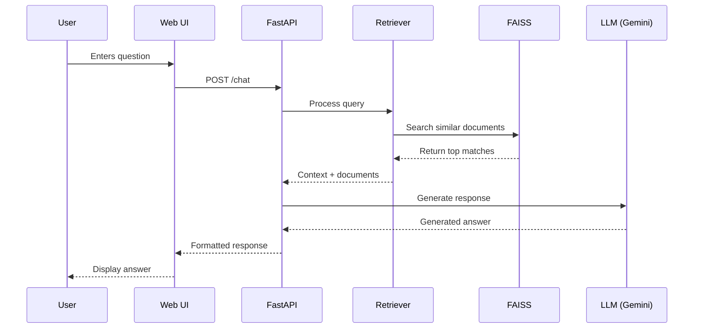

# Changi Airport RAG Chatbot Architecture

## System Overview

```mermaid
graph TD
    A[User] -->|HTTP Request| B[FastAPI Server]
    B -->|Query| C[Retrieval System]
    C -->|Context| D[LLM Generation]
    D -->|Response| B
    B -->|Display| A
    
    subgraph Backend
        B
        C
        D
        E[FAISS Vector Store]
        F[Gemini LLM (Google Generative AI)]
    end
    
    C -->|Search| E
    D -->|Generate| F
    F -->|Embed| E
```

## Component Details

### 1. FastAPI Server (`main.py`)
- Handles HTTP requests and WebSocket connections
- Manages chat sessions
- Routes requests to appropriate handlers
- Serves static files and API endpoints

### 2. Retrieval System
- Processes user queries
- Retrieves relevant context using FAISS
- Implements MMR (Maximal Marginal Relevance) for diverse results
- Handles fallback retrieval strategies

### 3. LLM Generation
- Primary model: Gemini Pro (Google Generative AI)
- Response improvement through prompt engineering
- Quality checking and validation

### 4. Vector Store (FAISS)
- Stores document embeddings
- Enables fast similarity search
- Persists between server restarts
- Indexed by document content and metadata

## Data Flow



## Performance Considerations

1. **Embedding Model**: Using Gemini Embeddings for cloud-based vectorization
2. **Retrieval**: FAISS for efficient similarity search
3. **Caching**: Session-based caching of common queries
4. **Batching**: Parallel processing where possible
5. **Fallbacks**: Prompt engineering for reliability

## Scaling

- **Horizontal Scaling**: Stateless API allows multiple instances
- **Vector DB**: Can be replaced with distributed vector DB if needed
- **Model Serving**: Gemini API is cloud-hosted
- **Caching**: Add Redis/Memcached for frequent queries
