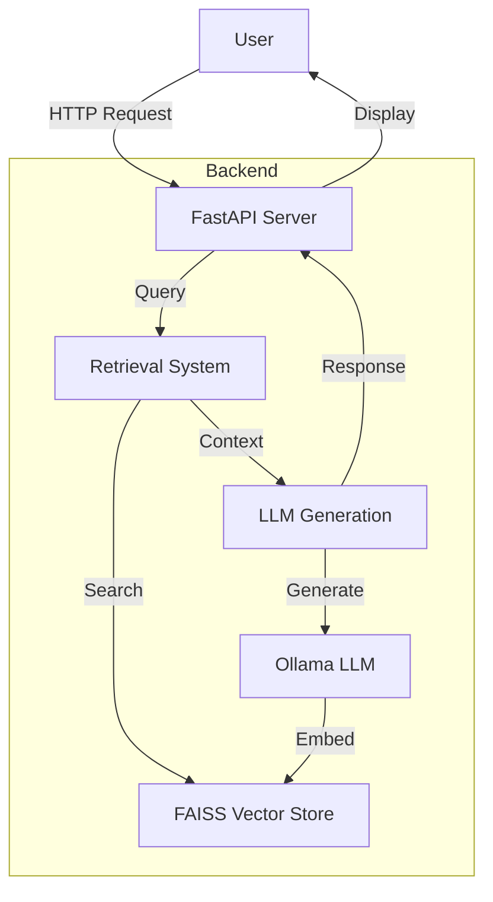
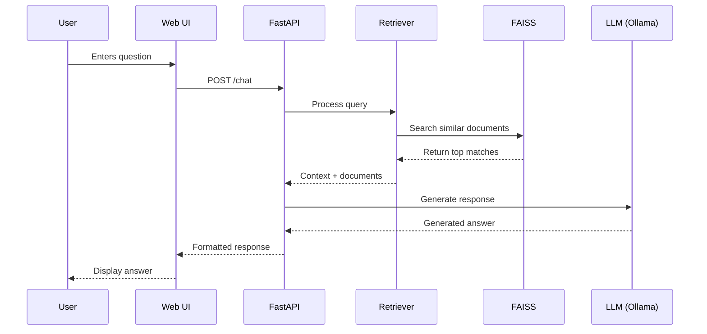

# Changi Airport RAG Chatbot Architecture

## System Overview

## Component Details

### 1. FastAPI Server (`app.py`)
- Handles HTTP requests and WebSocket connections
- Manages chat sessions
- Routes requests to appropriate handlers
- Serves static files and API endpoints

### 2. Retrieval System
- Processes user queries
- Retrieves relevant context using FAISS
- Implements MMR (Maximal Marginal Relevance) for diverse results
- Handles fallback retrieval strategies

### 3. LLM Generation
- Primary model: Mistral (via Ollama)
- Fallback model: Llama2 (via Ollama)
- Response improvement through summarization
- Quality checking and validation

### 4. Vector Store (FAISS)
- Stores document embeddings
- Enables fast similarity search
- Persists between server restarts
- Indexed by document content and metadata

## Data Flow

## Performance Considerations

1. **Embedding Model**: Using `all-minilm` for fast, local embeddings
2. **Retrieval**: FAISS for efficient similarity search
3. **Caching**: Session-based caching of common queries
4. **Batching**: Parallel processing where possible
5. **Fallbacks**: Multiple models for reliability

## Scaling

- **Horizontal Scaling**: Stateless API allows multiple instances
- **Vector DB**: Can be replaced with distributed vector DB if needed
- **Model Serving**: Ollama can be scaled separately
- **Caching**: Add Redis/Memcached for frequent queries
